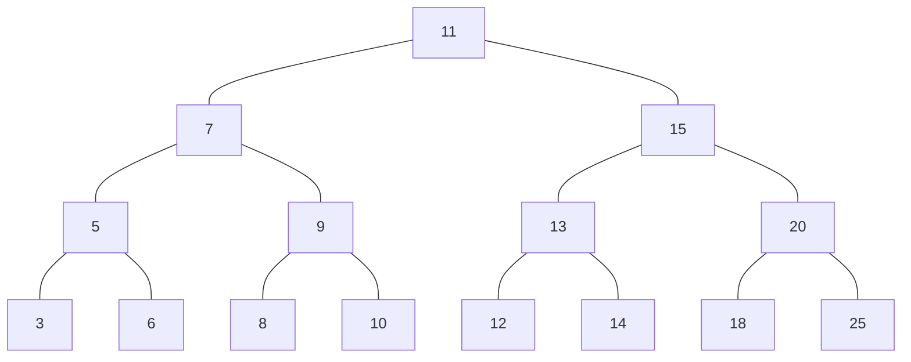
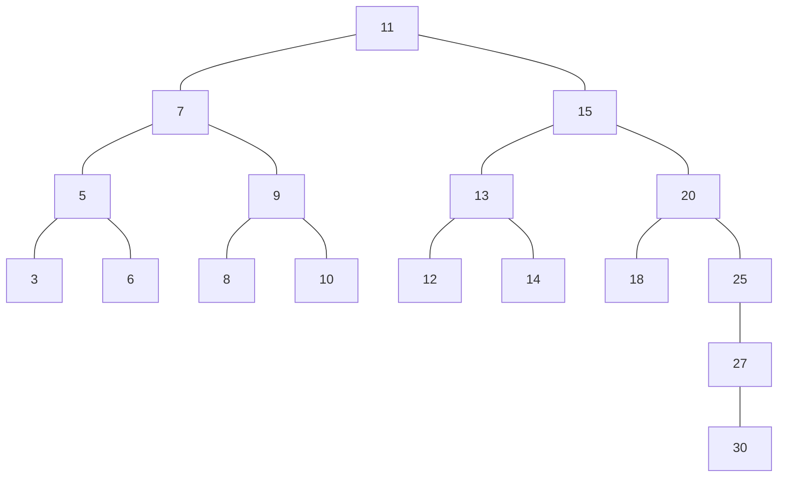
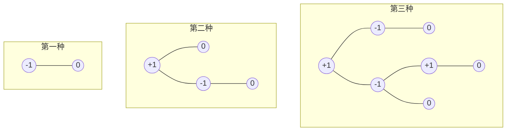
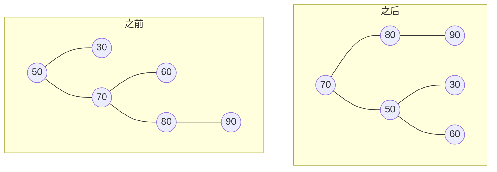
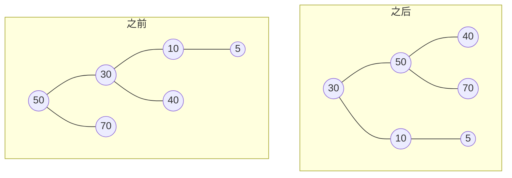
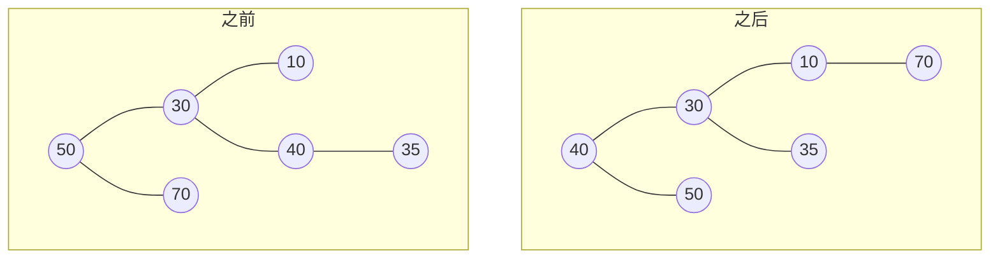
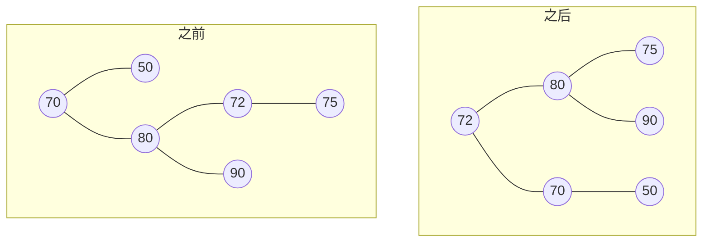
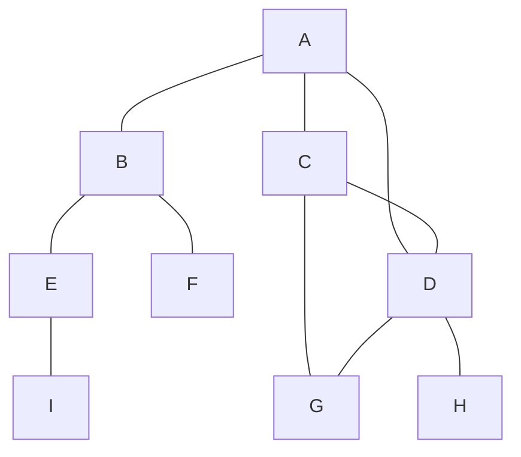

## 前言

虽然知道自己很努力, 也进入过大公司. 但是一直以来自己在计算机科学的基础方面都很薄弱, 因为自己并不是科班出身, 因此很希望能够通过后天弥补拉近与科班出身同学的差距, 因此作为程序员的三大梦(语言/算法/图形)之一, 数据结构和算法一直是我心头的一个心病, 总是在空闲的时间逛一些技术社区的时候被一些标题党的数据和算法相关标题吸引进去, 点进去看后又空洞无物. 因此终于下定决心要好好学习一下算法(基础).

这篇文章即是我学习后记录的产物, 是在看 <学习 JavaScript 数据结构与算法(第2版)> 时候的总结和备忘, 先从数据结构入手, 然后是数据结构的各种算法. 大部分使用 ES5 方法, 少部分使用 ES6 方法. 只实现效果, 不考虑一些诸如执行开销等不相关问题(如使用在每个实例上添加方法而不是使用原型链等)

## 栈

### 栈的基本概念和方法

栈是一种遵从后进先出(LIFO)原则的有序集合. 新添加或待删除的元素保存在栈的一端, 称作栈顶, 另一端称作栈底. 在栈里, 新元素都靠近栈顶, 旧元素都靠近栈底. 形象的例子就是一摞书. 栈数据结构有以下方法:
1. `push(element)` 添加一个或几个元素
2. `pop()` 移除栈顶的元素, 返回被移除的元素
3. `peek()` 返回栈顶的元素, 不修改原始栈
4. `isEmpty()` 判断栈是否为空
5. `clear()` 清空栈
6. `size()` 返回栈里的元素个数

### 栈的 JavaScript 实现

1. [栈](/static/example-code/2019/Stack.js)

### 栈的应用

1. [十进制转二进制](/static/example-code/2019/DecimalToBinary.js)
2. [汉诺塔](/static/example-code/2019/TowerOfHanoi.js)

## 队列

### 队列的基本概念和方法

队列是遵循FIFO(First In First Out 先进先出)原则的一组有序项. 队列在尾部添加新元素, 并从顶部移除元素. 最新添加的元素必须排在队列的末尾. 队列数据结构有以下方法:

1. `enqueue(element)` 向队列尾部添加一个(或多个)新的项
2. `dequeue()` 移除队列的第一项(最先添加的元素), 并返回被移除的元素
3. `front()` 返回队列中第一个元素(最先添加的元素), 队列不变
4. `isEmpty()` 返回队列是否为空
5. `size()` 队列元素个数

### 队列的 JavaScript 实现

1. [队列](/static/example-code/2019/Queue.js)
2. [加权队列](/static/example-code/2019/PriorityQueue.js)

## 链表

### 链表的基本概念和方法

链表的每项不仅存有自身的值, 还存有一个指针, 该指针指向下一个项的位置, 此谓之单向链表; 如果每项不但存有指向下一个项的位置指针, 还有一个指向上一个项的指针(除了开头/结尾项, 它们指向上一个/下一个的指针为 null), 则此谓之双向链表; 如果双向链表的首尾相连, 则谓之双向循环链表. 像下面这样(箭头就是指针, 是箭头尾部项的一部分):

1. 单向链表
   ```mermaid
   graph RL
   A(Tail) --> B(第三项) --> C(第二项) --> D(Head)
   ```
2. 双向链表
   ```mermaid
   graph LR
   A(Head) --> B(第二项) --> A
   B --> C(第三项) --> B
   C --> D(Tail) --> C
   ```
3. 循环链表
   ```mermaid
   graph LR
   A(Head) --> B(第二项) --> A
   B --> C(第三项) --> B
   C --> D(Tail) --> C
   A --> D --> A
   ```

链表有以下方法:

1. `append(element)` 向链表尾部添加一个新的项
2. `insert(position, element)` 向链表的特定谓之插入一个新的项
3. `remove(element)` 从链表移除一个项
4. `indexOf(element)` 返回元素在链表中的索引, 如果没有则返回 -1;
5. `removeAt(position)` 移除链表指定位置的项
6. `isEmpty()` 链表是否为空
7. `size()` 链表项个数

### 链表的 JavaScript 实现

1. [单向链表](/static/example-code/2019/LinkedList.js){:data-open=""}
2. [双向链表](/static/example-code/2019/DoublyLinkedList.js){:data-open=""}
3. [循环链表](/static/example-code/2019/CircularLinkedList.js){:data-open=""}

## 集合

### 集合的基本概念和方法

集合是由一组无序且唯一(即不能重复)的项组成的, 集合有以下方法:

1. `add(value)` 向集合添加一个新的项
2. `remove(value)` 从集合移除一个项
3. `has(value)` 判断项是否在集合中
4. `clear()` 清空集合
5. `size()` 集合的大小
6. `values()` 包含集合所有值的数组
7. `union(set)` 与另一个集合的并集
8. `intersection(set)` 与另一个集合的交集
9. `difference(set)` 与另一个集合的差集(当前集合减去指定集合)
10. `subset(set)` 判断一个集合是否为另一个集合的子集

### 集合的 JavaScript 实现

一般使用对象或者 ES6 的 Set 实现, 细节略

## 字典

### 字典的基本概念

集合表示一组互不相同的元素, 在集合中, 使用对象存储, 形式是 `{值: 值}` 的形式. 而在字典中, 使用的是 `{键: 值}` 的形式, 字段也被称作`映射`, 字典通常有以下方法:

1. `set(key, value)` 向字典中添加项
2. `delete(key)` 删除拥有指定键的项
3. `has(key)` 判断含有 key 的某项是否存在于字字典中
4. `get(key)` 查找特定键的项, 并返回该项
5. `clear()` 清空字典
6. `size()` 返回字典的大小
7. `keys()` 将字典中所有包含项的键以数组形式返回
8. `values()` 将字典中所有包含项的值以数组形式返回

### 字典的 JavaScript 实现

略

## 散列表

散列表, 即 HashTable(数组实现), 也叫 HashMap(对象实现), 它是字典数据结构的一种散列表实现方式. 如果字典需要找到一个项, 则最坏的情况需要遍历整个数据结构. 如果使用散列表, 以及使用附带的散列算法, 就知道值的具体位置, 因此就能够款速检索到该值. 散列函数的作用是给定一个键值, 返回值在散列表中的地址.

### 散列表的用途

你可能会问, 为什么需要散列表呢? 在 JavaScript 中, 直接使用对象来获取键值映射, 就是 O(1) 的速度了呀. 这话没错, 但是试想如果有重复的键, 该怎么办呢? 比如, 想要构建一个花名册, 来记录不同同学的信息. 那么同名的同学怎么办呢? 这时候就需要一种算法来使每个同学的名字作为输入, 而输出都是独一无二的, 这样才能做到`一一对应`, 从而实现 O(1) 的算法, 此谓之完美散列, 数学中这叫做完全单射函数. 但是这样如果存储上百万个数据, 会使得该 `Object` 对象非常之庞大, 导致性能问题. 因此需要散列算法, 来使得时间和空间做一个平衡.

还拿上述花名册做例子, 如果有同名的同学, 则依然以这个名字作为键, 只是值不再单单的是一个同学的信息, 而是一个同学信息的数组(或链表), 给定同学名后, 如果发现对应的值是数组, 则遍历该数组直到找到准确的同学信息. 这样就平衡了时间(比之前的时间O(1)要长❌)和空间(比之前的 Object 对象占用的空间要小✅). 一个好的散列算法, 应该能保证每个键上的数组都是相差不大的.

### 散列表的基本方法

1. `put(key, value)` 向散列表新增一项
2. `remove(key)` 根据键从散列表移除项
3. `get(key)` 根据键查找项

### 一个最简单的散列函数

> 以输入是字符串为例, 暂时不考虑相同字符串, 数据结构使用数组, 这样可以将 key 作为键

```js
let loseloseHashCode = function(key){
    let hash = 0;
    for (let i = 0; i < key.length; i++) {
        hash += key.charCodeAt(i);
    }
    return hash % 37;
}
```

### 解决散列表中的冲突

通过上述散列算法可以看到, 算出来的键是可能冲突的, 也就是说数组中相同 key 可能有不同的值, 这样就会被覆盖, 因此需要解决冲突. 有三种方案:

1. `分离链接` 即如果散列算法生成的键相同的时候, 键不再直接指向值, 而是指向一个数组/链表, 将问题转化为数组/链表插入/查找
2. `线性探查` 即如果散列算法生成的键相同的时候, 键自动+1再次尝试存储, 如果仍然键冲突, 则继续+1, 知道找到为空的位置(适用于键是数字的散列表形式, 如数组), 还有些更棒的针对数字键的散列实现在 [这个地方](http://web.archive.org/web/20071223173210/http://www.concentric.net/~Ttwang/tech/inthash.htm)
3. `双散列法` 即如果散列算法生成的键相同的时候, 再次对冲突使用另一个或者相同散列函数进行键的生成.

### 散列表的 JavaScript 实现

1. [普通散列表实现(可能会有冲突)](/static/example-code/2019/HashTable.js)
2. [分离链接](/static/example-code/2019/HashCollisionSeparateChaining.js)
3. [线性探查](/static/example-code/2019/HashCollisionLinearProbing.js)

## 树

### 树的相关术语

先看结构示意图:



其中:

1. 11 是第 0 层, 7/15 是第 1 层, 5/9/13/20 是第 2 层, 其他是第 3 层
2. 11 叫根节点, 其他叫子节点. 至少有一个子节点的节点称为内部节点, 没有子元素的节点成为外部节点
3. 节点有深度属性, 如节点 3 有三个祖先元素, 因此深度为 3
4. 树的高度取决于所有节点深度的最大值
5. 这是一颗完全二叉树, 因为它们除了最下面一层节点没有自己点外, 其他节点都有两个节点

> 注意: 相同的数据可能会有好几种树结构, 并不一定是唯一的表现形式, 因此才会有下下节的`AVL树`---它为尽量用数据构建成为一颗完全树

### 二叉树和二叉搜索树

`二叉树`的节点最多只能有两个子节点, 一个是左侧子节点, 另一个是右侧子节点. `二叉搜索树`(BST)是二叉树的一种, 但是它只允许你在任意节点的左侧存储比该节点小的值, 在任意节点的右侧存储比该节点大或等于的值. 示意图中就是一颗二叉搜索树, 有以下方法:

1. `insert(key)` 插入新的节点
2. `sertch(key)` 查找一个节点或返回 null
3. `inOrderTraverse` 中序遍历所有节点
4. `preOrderTraverse` 先序遍历所有节点
4. `postOrderTraverse` 后序遍历所有节点
5. `min` 返回树中的最小的值
6. `max` 返回树种最大的值
7. `remove(key)` 移除树中某项

### 树的遍历图示:

1. 中序遍历---常用来对树进行排序操作
   
    ```mermaid
    graph TD;
        11---7;
        11---15;
        7---5;
        7---9;
        5---3;
        5---6;
        9---8;
        9---10;
        15---13;
        15---20;
        13---12;
        13---14;
        20---18;
        20---25;
        3-.->5
        5-.->6;
        6-.->7;
        7-.->8;
        8-.->9;
        9-.->10;
        10-.->11;
        11-.->12;
        12-.->13;
        13-.->14;
        14-.->15;
        15-.->18;
        18-.->20;
        20-.->25;
    ```

    遍历顺序是:3 5 6 7 8 9 10 11 12 13 14 15 18 20 25

2. 先序遍历---常用来打印一个结构化的文档, 示例图中的遍历顺序是: 11 7 5 3 6 9 8 10 15 13 12 14 20 18 25

3. 后序遍历---应用于计算一个目录和它的子目录中所有文件所占空间的大小, 示例图中的遍历顺序是: 3 6 5 8 10 9 7 12 14 13 18 25 20 15 11

### Adelson-Velskii-Landi 树(AVL树)

VAL 树是一种自平衡树. 二叉树在某些情况下可能会导致有个子树过深, 而某些子树过浅, 如下图:


这个树的右侧过深, 在搜索添加删除某个节点的时候可能会引起一些性能问题, 因此需要 AVL 自平衡树. AVL 是一种自平衡二叉搜索树, 意思是任何一个节点左右两侧子树的高度之差最多为 1. 也就是说这种树会在添加或者移除节点的时候尽量试着成为一颗完全树.

#### AVL 树的平衡因子及计算

在 AVL 树种插入和删除节点和 BST 完全相同, AVL 的不同之处在于需要在插入/删除的时候检查它的`平衡因子`, 如果有需要则将其应用于树的自平衡. 在 AVL 树中需要对每个节点计算右子树高度(hr)和左子树高度(hl)的差值, 如果该值(hr-hl)不是 0/1/-1 的其中一个值, 则需要平衡该 VAL 树. 这就是平衡因子的概念.下面三颗树都是平衡的:




#### AVL 树的旋转

在向 AVL 树插入节点的时候, 可以执行单旋转或双旋转两种平衡操作, 分别对应四种场景:

1. `右---右(RR)` 向左的单旋转
2. `左---左(LL)` 向右的单旋转
3. `左---右(LR)` 向右的双旋转
4. `右---左(RL)` 向左的双旋转

右---右(RR): 向左的单旋转示意图(mermaid绘图这个地方无法绘制成二叉树导致80在左边50在右边):


左---左(LL)): 向右的单旋转示意图(mermaid绘图这个地方无法绘制成二叉树导致50在左边10在右边):


左---右(LR): 向右的双旋转示意图(基本上就是做一次RR旋转后再做一次LL旋转):


右---左(RL): 向左的双旋转示意图(基本上就是做一次LL旋转后再做一次RR旋转, mermaid绘图这个地方无法绘制成二叉树导致80在左边70在右边):


尽管 AVL 树是自平衡的, 但是其插入或移除节点的性能并不总是最好的. 更好的选择是红黑树, [红黑树](http://goo.gl/OxED8K) 可以高效有序地遍历其节点.

### 树的基本方法的 JavaScript 实现

1. [二叉树](/static/example-code/2019/BinarySearchTree.js)
2. [AVL 树](/static/example-code/2019/AVLTree.js)
3. [红黑树](/static/example-code/2019/RedBlackTree.js)
4. [堆积树](http://goo.gl/SFlhW6)

## 图

### 图的基本概念

图是网络结构的抽象模型. 图示一组由边连接的节点(或定点). 任何二元关系都可以用图来表示. 可以使用图来解决两点间最短路径等问题.

### 图在数学上的概念

一个图 G=(V, E) 由以下元素组成

1. V 一组定点
2. E 一组边, 连接 V 中的顶点

下面表示一个图:



### 图的相关术语

上述图中:

1. 由一条边连接在一起的顶点称为`相邻顶点`
2. 一个顶点的`度`是其相邻顶点的数量, 上图中 A 和其他三个顶点相邻, 因此 A 的度为 3; E 的度为 2;
3. `路径`是顶点 v1, v2,...vk 的一个连续序列, 其中 vi 和 v(i+1) 是相邻的. 上图中包含路径 ABEI 和 ACDG
4. `简单路径`要求不包括重复的顶点, 如 ADG 是一条简单路径. 除去最后一个顶点(因为它和第一个顶点是相同顶点), `环`也是一个简单路径, 如 ADCA(最后一个顶点重新回到A))
5. 如果图中不存在环, 则称该图是`无环`的. 如果图中每两个顶点间都存在路径, 则该图是`连通的`
6. 图可以使`有向的`(边有方向)也可以是`无向的`(边没有方向), 上图是一个`无向图`
7. 如果图中每两个顶点间在双向上都存在路径, 则该图是`强连通`的
8. 图还可以是`未加权的`, 或是`加权的`, 加权图的边被赋予了权值

### 图的表示

#### 邻接矩阵

图最常见的实现是邻接矩阵, 每个节点都和一个整数相关联, 该证书将作为数组的索引. 用一个二维数组来表示顶点之间的连接. 如果索引为 i 的节点和索引为 j 的节点相邻, 则 array[i][j] === 1 否则 array[i][j] === 0. 上述的图用邻接矩阵表示为:

||A|B|C|D|E|F|G|H|I
-|-|-|-|-|-|-|-|-|-
A|0|1|1|1|0|0|0|0|0
B|1|0|0|0|1|1|0|0|0
C|1|0|0|1|0|0|1|0|0
D|1|0|1|0|0|0|1|1|0
E|0|1|0|0|0|0|0|0|1
F|0|1|0|0|0|0|0|0|0
G|0|0|1|1|0|0|0|0|0
H|0|0|0|1|0|0|0|0|0
I|0|0|0|0|1|0|0|0|0

不是强连通的图称为`稀疏图`, 如果用邻接矩阵来表示, 矩阵中将会有很多 0, 这意味着我们浪费了计算机中的存储空间来表示根本不存在的边.

#### 邻接表

邻接表由图中每个顶点的相邻顶点列表所组成. 存在好几种方式来表示这种数据结构. 可以用列表(数组)/链表/甚至是散列表或者字典来表示相邻顶点列表. 上述图可以用下面的邻接表表示:

A|B|C|D||
-|-|-|-|-
B|A|E|F
C|A|D|G
D|A|C|G|H
E|B|I
F|B
G|C|D
H|D
I|E

#### 关联矩阵(略)

#### 图的相关方法

1. `addVertex(v)` 增加新的顶点
2. `addEdge(v, w)` 增加新的边

### 图的遍历

图的遍历可以用来寻找特定的顶点或者寻找两个顶点之间的路径, 检查图是否连通, 检查图是否含有环等. 图的遍历算法的基本思想是, 必须追踪每个第一次访问的节点, 并且追踪有哪些节点还没有被完全探索(即它还有子节点未被探索完全). 对于下面两种搜索(遍历)模式, 都需要明确指出第一个被访问的顶点. 完全探索一个顶点要求我们查看该顶点的每一条边, 对一每一条边所连接的没有被访问过的顶点, 将其标注为被发现的, 并将其加进待访问顶点列表中. 为了保证算法的效率, 务必访问每个顶点至多两次. 连通图中每条边和顶点都会被访问到. 可以用三个状态表示顶点的访问状态: 未被访问/被访问, 但未被探索完全/完全被探索过

#### 图的广度优先搜索(Breadth-First Search, BFS)

待访问顶点列表的数据结构是队列, 将顶点存入队列中, 最先入队列的顶点先被探索.

广度优先搜索被用来寻找最短路径(下面有实现). `Dijkstra 算法`解决了单源最短路径问题(`贪心算法`). `Bellman-Ford 算法`解决了边权值为负的单源最短路径问题. `A*搜索算法`解决了求仅一对顶点间的最短路径问题, 它用经验法则来加速搜索过程. `Floyd-Warshall 算法`解决了求所有顶点对键的最短路径这一问题(`动态规划算法`)

#### 图的深度优先搜索(Depth-First Search, DFS)

待访问顶点列表的数据结构是栈, 将顶点存入栈中, 顶点是沿着路径被探索的, 存在新的相邻顶点就去访问. 当我们需要编排一些任务或步骤的执行顺序时, 这称为`拓扑排序(topsort/toposort))`, 我们可以使用深度优先搜索来进行拓扑排序. 拓扑排序只能用于`有向无环图(DAG)`, 下方有具体实现.

### 最小生成树(MST)

`最小生成树`是网络设计中常见的问题. 如你的公司有几间办公室, 要以最低的成本实现办公室电话线路相互连通, 以节省资金, 最好的办法是什么? 这也可以应用于岛桥问题. 设想你要在 n 个岛屿之间建造桥梁, 想用最低的成本实现所有岛屿的相互连通. 这两个问题都可以用`MST算法`来解决:

1. Prim 算法
    
    用来求解加权无向连通图的MST问题的贪心算法, 它能找出一个边的子集, 使得其构成的树包含图中所有顶点, 且边的权值之和最小.

2. Kruskal 算法
    
    和上面一样也是求加权无向连通图MST问题的贪心算法.

#### 图的 JavaScript 实现

1. [图](/static/example-code/2019/Graph.js)
2. [最短路径算法](/static/example-code/2019/ShortestPath.js)
3. [最小生成树](/static/example-code/2019/MinimumSpanningTree.js)

## 排序和搜索算法

### 排序算法

1. `冒泡排序` 复杂度 O(n<sup>2</sup>) 两层循环, 满足条件则交换内层循环的两个值
2. `选择排序` 复杂度 O(n<sup>2</sup>) 两层循环, 内层循环找到最小值, 并将其放到第一位, 然后接着找到第二小的值放到第二位
3. `插入排序` 复杂度 O(n<sup>2</sup>) 从头开始, 每次假定前面的都已经排过序, 然后判断当前值确定该值是在前面排过序数组的哪个位置, 插入之, 然后继续判断下一个值
4. `归并排序` 复杂度 O(nlog<sup>n</sup>) 递归思想, 先将数组分成较小的数组, 然后将每个较小数组两个两个排序(像两副已经各自排好序的扑克牌排序一样), 直到排序完成
5. `快速排序` 复杂度 O(nlog<sup>n</sup>) 选一个主元(pivot)然后将数据划分两半, 大于它的放右边, 小于它的放左边, 直到左指针超过右指针
6. `堆排序` 把数组当做二叉树来排序, 规则是:
   1. 索引 0 是树的根节点
   2. 除根节点以外. 任意节点 N 的父节点是 N/2
   3. 节点 L 的左子节点是 2 * L
   4. 节点 R 的右子节点是 2 * R + 1
   5. 如数组 [3, 5, 1, 6, 4, 7, 2] 可以看做下面的树:
      ```mermaid
      graph TD;
      A((3))---B((5))
      A---C((1))
      B---D((6))
      B---E((4))
      C---F((7))
      C---G((2))
      ```
7. 计数排序
8. 桶排序
9. 基数排序(分布式排序)

### 搜索算法

1. 顺序搜索
2. 二分搜索

### 排序/搜索算法的 JavaScript 实现

1. [各种排序/搜索算法汇总](/static/example-code/2019/SortingSearchingAlgorithms.js)

## 算法模式

### 动态规划

1. `背包问题` 给出一组项目, 各自有值和容量, 目标是找出总值最大的项目的集合. 限制是总容量必须小于等于背包的容量.
2. `最长公共子序列` 找出一组序列的最长公共子序列(可由另一序列删除元素但不改变余下元素的顺序得到)
3. `矩阵链相乘` 给出一系列矩阵, 目标是找到这些矩阵相乘的最高效办法(计算次数尽可能少). 相乘操作不会进行, 解决方案是找到这些矩阵各自相乘的顺序,
4. `硬币找零` 给出面额为 d1, d2...dn 的一定数量的硬币和要找零的钱数, 找出有多少种找零的方法
5. `图的全源最短路径` 对所有顶点对(u, v), 找出从顶点 u 到顶点 v 的最短路径(之前有 Floyd-Warshall 算法可以解决)

### 算法模式的 JavaScript 实现

1. [递归](/static/example-code/2019/Recursion.js)
2. [最少硬币找零DP算法](/static/example-code/2019/MinCoinChangeDP.js)
2. [最少硬币找零贪心算法](/static/example-code/2019/MinCoinChangeGreedy.js)
3. [背包问题DP算法](/static/example-code/2019/KnapsackProblemDP.js)
4. [背包问题递归算法](/static/example-code/2019/KnapSackProblemRecursive.js)
5. [背包问题贪心算法](/static/example-code/2019/KnapSackProblemGreedy.js)
6. [最长公共子序列DP算法](/static/example-code/2019/LongestCommonSubsequenceDP.js)
7. [最长公共子序列递归算法](/static/example-code/2019/LongestCommonSubsequenceRecursive.js)
8. [矩阵链相乘DP算法](/static/example-code/2019/MatrixChainMultiplicationDP.js)
9. [矩阵链相乘递归算法](/static/example-code/2019/MatrixChainMultiplicationRecursive.js)

## NP完全理论概述

一般来说, 如果一个算法的复杂度为 O(n<sup>k</sup>), 其中 k 是常数, 我们就认为这个算法是高效的, 这就是多项式算法. 对于给定的问题, 如果存在多项式算法, 则计为 P(polynomial, 多项式)

还有一类 NP(nondeterministic polynomial, 非确定性多项式)算法. 如果一个问题可以在多项式时间内验证解是否正确, 则计为 NP.

如果一个问题存在多项式算法, 自然可以再多项式时间内验证其解, 因此所有的 P 都是 NP. 然而, P=NP 是否成立, 仍然不得而知.

NP 问题最难的是 `NP完全` 问题, 它满足以下两个条件:
1. 是 NP 问题, 也就是说, 可以在多项式时间内验证解, 但还没找到多项式算法
2. 所有的 NP 问题都能在多项式时间内归约为它

还有一类问题, 只需满足 NP 完全问题的第二个条件, 成为 NP 困难问题. 因此, NP 完全问题是 NP 困难问题的子集.

非 NP 完全问题的 NP 困难问题的例子有`停机问题`和`布尔可满足性问题(SAT)`, NP 完全问题的例子有`子集和问题`, `旅行商问题`, `顶点覆盖问题` 等等

最后, 刚才有些问题是`不可解`的, 然后仍然有办法在符合要求的时间内找到一个近似解. `启发式算法` 就是其中之一. 启发式算法得到的未必是最优解, 单足够解决问题了.

启发式算法的例子有`局部搜索`, `遗传算法`, `启发式导航`, `机器学习`等. 更多可以[查看这里](http://goo.gl/gxIu9w)

